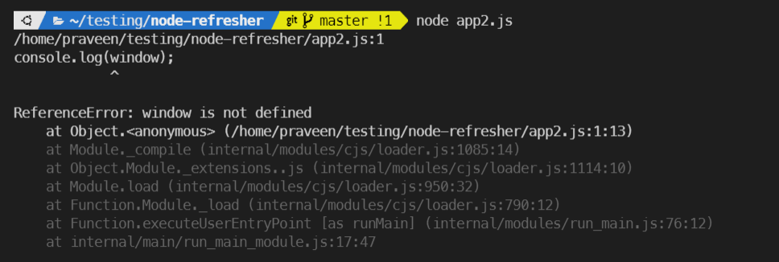
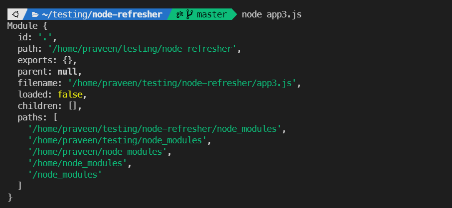

# NodeJS Refresher

https://v8.dev/

https://en.wikipedia.org/wiki/V8_(JavaScript_engine)

## JS Engines

Node is a C++ program which includes V8 engine. It provides the runtime environment for Javascript code.

# Oops! window is not defined 😉

Use global.console.log(), instead window.console.log().

Variables are not added to global object. They are scoped to the file. (Node uses a modular system. Every file in a Node application is a module)

# console.log(module) 👍

